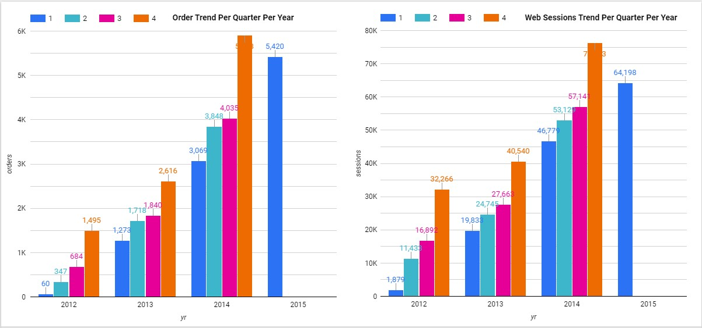
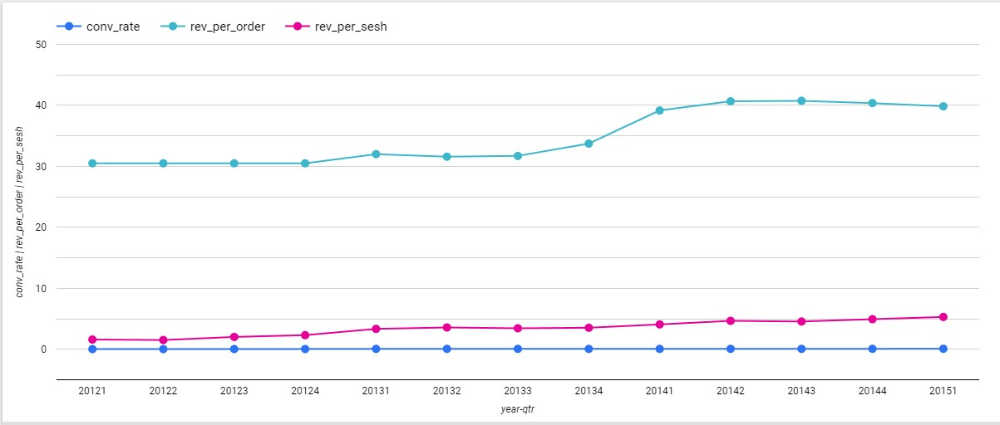
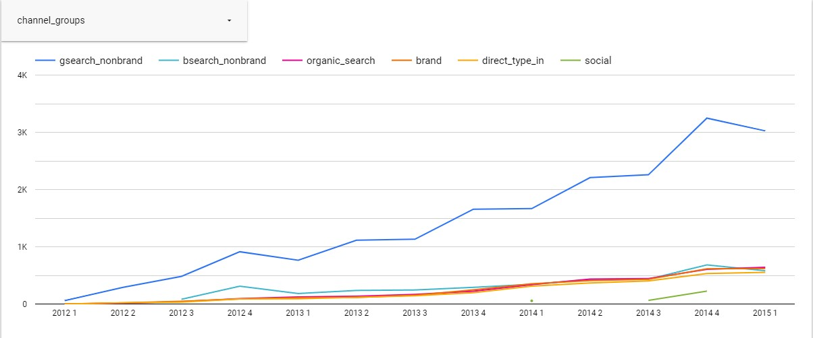
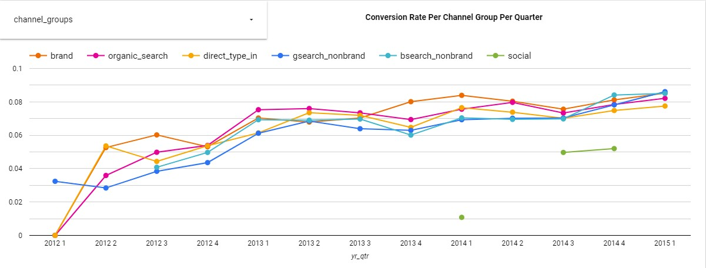

# ECommerce Website Analysis

**Situation** I'm working as a data analyst for an ecommerce company. Time period is 2012 - 2015. The following analysis need to be made in order to show that the company is growing in terms of revenue, orders, and website sessions. 

I used MYSQL to do my SQL queries and house my data. Google Looker Studio was used to visualize the results. 

Google looker studio dashboard can be found <a href="https://lookerstudio.google.com/u/0/reporting/f52d1e60-158b-491a-b419-144e640c4386/page/HSSMD"> here </a>

### 1. Pull overall session and order volume, trended by quarter for the life of the business. 

```SQL
SELECT 
    year(website_sessions.created_at) AS yr,
    quarter(website_sessions.created_at) AS qtr,
    COUNT(DISTINCT website_sessions.website_session_id) AS sessions, 
    COUNT(DISTINCT orders.order_id) AS orders
FROM 
	website_sessions
		LEFT JOIN orders
			ON website_sessions.website_session_id = orders.website_session_id 
WHERE 
	website_sessions.created_at <= '2015-03-20'
GROUP BY 
	1,2;
```



Fourth quarter is always the strongest quarter for the company in terms of website sessions and orders. 

### 2. Quarterly figures since launching for session-to-order conversion rate, revenue per order, revenue per session.

```SQL
SELECT 
	year(website_sessions.created_at) AS yr,
   	quarter(website_sessions.created_at) AS qtr,
	COUNT(DISTINCT orders.order_id) / COUNT(DISTINCT website_sessions.website_session_id) AS conv_rate,
	(SUM(orders.price_usd) - SUM(orders.cogs_usd)) / COUNT(DISTINCT orders.order_id) AS rev_per_order,
    	SUM(orders.price_usd) / COUNT(DISTINCT website_sessions.website_session_id) AS rev_per_sesh
FROM 
	website_sessions
		LEFT JOIN orders
			ON website_sessions.website_session_id = orders.website_session_id 
WHERE 
	website_sessions.created_at <= '2015-03-20'
GROUP BY 
	1,2;
```


We're seeing a steady growth when it comes to revenue per session, revenue per order, and conversion rate. 

### 3. Could you pull a quarterly view of orders from Gsearch nonbrand, Bsearch nonbrand, brand search overall, organic search, and direct type-in

```SQL
SELECT
CONCAT(YEAR(website_sessions.created_at), " ", quarter(website_sessions.created_at)) AS yr_qtr,
CASE
	WHEN website_sessions.utm_source = 'gsearch' AND website_sessions.utm_campaign = 'nonbrand' THEN 'gsearch_nonbrand'
	WHEN website_sessions.utm_source is null and website_sessions.http_referer IN ('https://www.gsearch.com', 'https://www.bsearch.com') THEN 'organic_search'
	WHEN website_sessions.utm_source = 'bsearch' AND website_sessions.utm_campaign = 'nonbrand' THEN 'bsearch_nonbrand' 
	WHEN website_sessions.utm_campaign = 'brand' THEN 'brand' 
    	WHEN website_sessions.utm_source is null and website_sessions.http_referer IN ('https://www.gsearch.com', 'https://www.bsearch.com') THEN 'organic_search'
	WHEN website_sessions.utm_source IS NULL and website_sessions.http_referer is NULL THEN 'direct_type_in' 
    	WHEN utm_source = 'socialbook' THEN 'social'
END AS channel_groups,
COUNT(DISTINCT orders.order_id) AS orders
FROM 
	website_sessions
		LEFT JOIN orders
			ON website_sessions.website_session_id = orders.website_session_id
WHERE 
	website_sessions.created_at <= '2015-03-20'
GROUP BY
	1,2;
```


<ul>
	<li>Gsearch nonbrand is the main source of web traffic and orders.</li>
	<li>Social is the worst performer, but it has only been around for three months from the time of analysis.</li> 
	<li>The company doesn't have much traction with direct type-in searches.</li>
</ul>

### 4. Pulling a quarterly view of sesion, orders, and conversion rates from Gsearch nonbrand, Bsearch nonbrand, brand search overall, organic search, and direct type-in.

```SQL 
SELECT
CONCAT(YEAR(website_sessions.created_at), " ", quarter(website_sessions.created_at)) AS yr_qtr,
CASE
	WHEN website_sessions.utm_source = 'gsearch' AND website_sessions.utm_campaign = 'nonbrand' THEN 'gsearch_nonbrand'
	WHEN website_sessions.utm_source is null and website_sessions.http_referer IN ('https://www.gsearch.com', 'https://www.bsearch.com') THEN 'organic_search'
	WHEN website_sessions.utm_source = 'bsearch' AND website_sessions.utm_campaign = 'nonbrand' THEN 'bsearch_nonbrand' 
	WHEN website_sessions.utm_campaign = 'brand' THEN 'brand' 
   	 WHEN website_sessions.utm_source is null and website_sessions.http_referer IN ('https://www.gsearch.com', 'https://www.bsearch.com') THEN 'organic_search'
	WHEN website_sessions.utm_source IS NULL and website_sessions.http_referer is NULL THEN 'direct_type_in' 
    WHEN utm_source = 'socialbook' THEN 'social'
END AS channel_groups,
COUNT(DISTINCT website_sessions.website_session_id) AS sessions,
COUNT(DISTINCT orders.order_id) AS orders,
COUNT(DISTINCT orders.order_id) / COUNT(DISTINCT website_sessions.website_session_id) AS conv_rate
FROM 
	website_sessions
		LEFT JOIN orders
			ON website_sessions.website_session_id = orders.website_session_id
WHERE 
	website_sessions.created_at <= '2015-03-20'
GROUP BY
	1,2;
```


<ul>
	<li>Although gsearch nonbrand has the highest orders as mentioned on the previous item the brand channel group has the best conversion rates.</li>
	<li>This means that gsearch nonbrand brings a lot of website traffic but only a small percentage of that traffic places an order.</li> 
	<li>The graph above also shows that all the channel groups have almost identical conversion rates.</li>
</ul>
