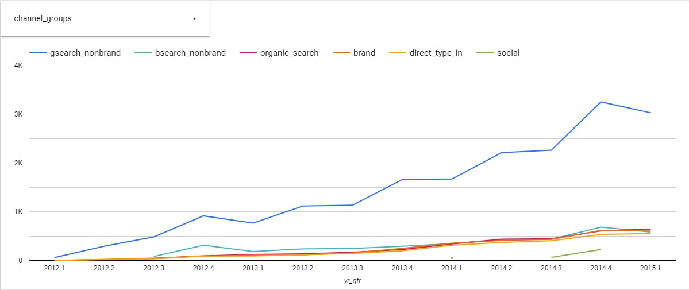

# ECommerce Website Analysis

**Situation** I'm working as a data analyst for an ecommerce company. Time period is 2012 - 2015. The following analysis need to be made in order to show that the company is growing in terms of revenue, orders, and website sessions. 

I used MYSQL to do my SQL queries and house my data. Google Looker Studio was used to visualize the results. 

Google looker studio dashboard can be found <a href="https://lookerstudio.google.com/u/0/reporting/f52d1e60-158b-491a-b419-144e640c4386/page/HSSMD"> here </a>

### 1. Pull overall session and order volume, trended by quarter for the life of the business. 

```SQL
SELECT 
    year(website_sessions.created_at) AS yr,
    quarter(website_sessions.created_at) AS qtr,
    COUNT(DISTINCT website_sessions.website_session_id) AS sessions, 
    COUNT(DISTINCT orders.order_id) AS orders
FROM 
	website_sessions
		LEFT JOIN orders
			ON website_sessions.website_session_id = orders.website_session_id 
WHERE 
	website_sessions.created_at <= '2015-03-20'
GROUP BY 
	1,2;
```


Fourth quarter is always the strongest quarter for the company in terms of website sessions and orders. 

### 2. Quarterly figures since launching for session-to-order conversion rate, revenue per order, revenue per session.

```SQL
SELECT 
	year(website_sessions.created_at) AS yr,
   	quarter(website_sessions.created_at) AS qtr,
	COUNT(DISTINCT orders.order_id) / COUNT(DISTINCT website_sessions.website_session_id) AS conv_rate,
	(SUM(orders.price_usd) - SUM(orders.cogs_usd)) / COUNT(DISTINCT orders.order_id) AS rev_per_order,
    	SUM(orders.price_usd) / COUNT(DISTINCT website_sessions.website_session_id) AS rev_per_sesh
FROM 
	website_sessions
		LEFT JOIN orders
			ON website_sessions.website_session_id = orders.website_session_id 
WHERE 
	website_sessions.created_at <= '2015-03-20'
GROUP BY 
	1,2;
```


We're seeing a steady growth when it comes to revenue per session, revenue per order, and conversion rate. 

### 3. Pulling a quarterly view of orders from Gsearch nonbrand, Bsearch nonbrand, brand search overall, organic search, and direct type-in.

```SQL
SELECT
CONCAT(YEAR(website_sessions.created_at), " ", quarter(website_sessions.created_at)) AS yr_qtr,
CASE
	WHEN website_sessions.utm_source = 'gsearch' AND website_sessions.utm_campaign = 'nonbrand' THEN 'gsearch_nonbrand'
	WHEN website_sessions.utm_source is null and website_sessions.http_referer IN ('https://www.gsearch.com', 'https://www.bsearch.com') THEN 'organic_search'
	WHEN website_sessions.utm_source = 'bsearch' AND website_sessions.utm_campaign = 'nonbrand' THEN 'bsearch_nonbrand' 
	WHEN website_sessions.utm_campaign = 'brand' THEN 'brand' 
    	WHEN website_sessions.utm_source is null and website_sessions.http_referer IN ('https://www.gsearch.com', 'https://www.bsearch.com') THEN 'organic_search'
	WHEN website_sessions.utm_source IS NULL and website_sessions.http_referer is NULL THEN 'direct_type_in' 
    	WHEN utm_source = 'socialbook' THEN 'social'
END AS channel_groups,
COUNT(DISTINCT orders.order_id) AS orders
FROM 
	website_sessions
		LEFT JOIN orders
			ON website_sessions.website_session_id = orders.website_session_id
WHERE 
	website_sessions.created_at <= '2015-03-20'
GROUP BY
	1,2;
```


<ul>
	<li>Gsearch nonbrand is the main source of web traffic and orders.</li>
	<li>Social is the worst performer, but it has only been around for three months from the time of analysis.</li> 
	<li>The company doesn't have much traction with direct type-in searches.</li>
</ul>

### 4. Pulling a quarterly view of sesion, orders, and conversion rates from Gsearch nonbrand, Bsearch nonbrand, brand search overall, organic search, and direct type-in.

```SQL 
SELECT
CONCAT(YEAR(website_sessions.created_at), " ", quarter(website_sessions.created_at)) AS yr_qtr,
CASE
	WHEN website_sessions.utm_source = 'gsearch' AND website_sessions.utm_campaign = 'nonbrand' THEN 'gsearch_nonbrand'
	WHEN website_sessions.utm_source is null and website_sessions.http_referer IN ('https://www.gsearch.com', 'https://www.bsearch.com') THEN 'organic_search'
	WHEN website_sessions.utm_source = 'bsearch' AND website_sessions.utm_campaign = 'nonbrand' THEN 'bsearch_nonbrand' 
	WHEN website_sessions.utm_campaign = 'brand' THEN 'brand' 
   	 WHEN website_sessions.utm_source is null and website_sessions.http_referer IN ('https://www.gsearch.com', 'https://www.bsearch.com') THEN 'organic_search'
	WHEN website_sessions.utm_source IS NULL and website_sessions.http_referer is NULL THEN 'direct_type_in' 
    WHEN utm_source = 'socialbook' THEN 'social'
END AS channel_groups,
COUNT(DISTINCT website_sessions.website_session_id) AS sessions,
COUNT(DISTINCT orders.order_id) AS orders,
COUNT(DISTINCT orders.order_id) / COUNT(DISTINCT website_sessions.website_session_id) AS conv_rate
FROM 
	website_sessions
		LEFT JOIN orders
			ON website_sessions.website_session_id = orders.website_session_id
WHERE 
	website_sessions.created_at <= '2015-03-20'
GROUP BY
	1,2;
```


<ul>
	<li>Although gsearch nonbrand has the highest orders as mentioned on the previous item the brand channel group has the best conversion rates.</li>
	<li>This means that gsearch nonbrand brings a lot of website traffic but only a small percentage of that traffic places an order.</li> 
	<li>The graph above also shows that all the channel groups have almost identical conversion rates.</li>
</ul>

### 5. Pulling monthly trends for revenue and margin by product, along with total sales and revenue.

```SQL
CREATE TEMPORARY TABLE products_table
SELECT 
YEAR(website_sessions.created_at) AS yr,
MONTH(website_sessions.created_at) AS mnth,
CASE 
	WHEN website_pageviews.pageview_url = '/the-original-mr-fuzzy' THEN 'mr_fuzzy'
   	 WHEN website_pageviews.pageview_url = '/the-forever-love-bear' THEN 'love_bear'
	WHEN website_pageviews.pageview_url = '/the-birthday-sugar-panda' THEN 'sugar_panda'
   	 WHEN website_pageviews.pageview_url = '/the-hudson-river-mini-bear' THEN 'hudson_bear'
    END AS product_type,
website_sessions.website_session_id
FROM 
	website_sessions
		LEFT JOIN website_pageviews
			ON website_sessions.website_session_id = website_pageviews.website_session_id 
WHERE 
	website_sessions.created_at <= '2015-03-20'
    AND website_pageviews.pageview_url IN ('/the-original-mr-fuzzy', '/the-forever-love-bear', '/the-birthday-sugar-panda', '/the-hudson-river-mini-bear');


-- PART 1 monthly trends
SELECT 
	products_table.yr,
    	products_table.mnth,
    	products_table.product_type, 
    	SUM(orders.price_usd) AS revenue, 
    	SUM(orders.price_usd) - SUM(orders.cogs_usd) AS margin
FROM 
	products_table
		LEFT JOIN orders
			ON products_table.website_session_id = orders.website_session_id 
GROUP BY 
	1,2,3;

-- Part 2 total revenue and margins
SELECT 
    products_table.product_type, 
    SUM(orders.price_usd) AS revenue, 
    SUM(orders.price_usd) - SUM(orders.cogs_usd) AS margin
FROM 
	products_table
		LEFT JOIN orders
			ON products_table.website_session_id = orders.website_session_id 
GROUP BY 
	1;
```

<ul>
	<li>Demand for all the four products is at the highest in November, December, and this carries out until January of next year.</li>
	<li>Starting February demand starts to decline and this carries out until the end of Q3.</li>
</ul>

### 6. Pulling monthly trends for revenue and margin by product, along with total sales and revenue.

```SQL
CREATE TEMPORARY TABLE products_next_clicks
SELECT
    products_viewers.website_session_id AS session_id,
    products_viewers.created_at,
    products_viewers.pageview_url AS viewed_page,
    MIN(website_pageviews.website_pageview_id) AS next_click,
    MIN(website_pageviews.pageview_url) AS next_clicked_page,
    MIN(website_pageviews.created_at) AS created_on
FROM (
SELECT
	website_pageview_id,
    created_at,
    website_session_id,
    pageview_url
FROM 
	website_pageviews
WHERE
	created_at < '2015-03-20'
	AND pageview_url = '/products'
) AS products_viewers
LEFT JOIN website_pageviews
	ON	products_viewers.website_session_id = website_pageviews.website_session_id 
    AND website_pageviews.created_at < '2015-03-20'
    AND website_pageviews.website_pageview_id > products_viewers.website_pageview_id
GROUP BY
	1,2,3;

SELECT* FROM products_next_clicks;

SELECT
	YEAR(created_at) AS yr,
    	MONTH(created_at) AS mnth, 
    	COUNT(DISTINCT session_id) AS sessions, 
    	COUNT(DISTINCT next_click) AS from_products,
    	COUNT(DISTINCT next_click) / COUNT(DISTINCT session_id) AS prcnt_mvr
FROM 
	products_next_clicks
GROUP BY 
	1,2;

CREATE TEMPORARY TABLE last_clickss
SELECT
    products_viewers.website_session_id AS session_id,
    products_viewers.created_at,
    products_viewers.pageview_url AS viewed_page,
    (website_pageviews.website_pageview_id) AS last_click,
    (website_pageviews.pageview_url) AS last_clicked_page,
    (website_pageviews.created_at) AS created_on
FROM (
SELECT
	website_pageview_id,
    created_at,
    website_session_id,
    pageview_url
FROM 
	website_pageviews
WHERE
	created_at < '2015-03-20'
	AND pageview_url = '/products'
) AS products_viewers
LEFT JOIN website_pageviews
	ON	products_viewers.website_session_id = website_pageviews.website_session_id 
    AND website_pageviews.created_at < '2015-03-20'
    AND website_pageviews.website_pageview_id > products_viewers.website_pageview_id;

SELECT
	YEAR(created_at) AS yr,
    	MONTH(created_at) AS mnth, 
    	COUNT(DISTINCT session_id) AS sessions, 
    	COUNT(DISTINCT CASE WHEN last_clicked_page = '/thank-you-for-your-order' THEN last_click ELSE NULL END) AS sessions_w_orders,
    	COUNT(DISTINCT CASE WHEN last_clicked_page = '/thank-you-for-your-order' THEN last_click ELSE NULL END) / COUNT(DISTINCT session_id) AS prcnt_mvr
FROM 
	last_clickss
GROUP BY 
	1,2;
```


<ul>
	<li>The amount of users visiting the /products page is increasing over time.</li>
	<li>Data for Q1 2015 is not yet complete thus the "decline" in the graph.</li>
	<li>The amount of users that visits another page after visiting the /products page is also steadily increasing.</li>
	<li>Conversion rate for users that have visited the /products page is also increasing.</li>
</ul>

### 7. Pull sales data since the 4th product was introduced on Dec 5, 2014 and show well each product cross sells with each other.

```SQL 
CREATE TEMPORARY TABLE primary_products
SELECT 
	orders.primary_product_id,
    orders.order_id
FROM orders
WHERE 
	orders.created_at > '2014-12-05';
   
 SELECT
 CASE
    WHEN primary_products.primary_product_id = 1 THEN 'Mr_Fuzzy'
    WHEN primary_products.primary_product_id = 2 THEN 'Love_Bear'
    WHEN primary_products.primary_product_id = 3 THEN 'Sugar_Panda'
    WHEN primary_products.primary_product_id = 4 THEN 'Hudson_River'
    END AS product_name,
    COUNT(DISTINCT xsell_items.order_id) AS total_orders,
    COUNT(DISTINCT CASE WHEN xsell_items.product_id = 1 AND xsell_items.is_primary_item = 0 THEN xsell_items.order_id ELSE NULL END) AS mr_fuzzy_xsell,
	COUNT(DISTINCT CASE WHEN xsell_items.product_id = 2 AND xsell_items.is_primary_item = 0 THEN xsell_items.order_id ELSE NULL END) AS love_bear_xsell,
    COUNT(DISTINCT CASE WHEN xsell_items.product_id = 4 AND xsell_items.is_primary_item = 0 THEN xsell_items.order_id ELSE NULL END) AS hudson_xsell,
    COUNT(DISTINCT CASE WHEN xsell_items.product_id = 3 AND xsell_items.is_primary_item = 0 THEN xsell_items.order_id ELSE NULL END) AS sugar_panda_xsell,
    COUNT(DISTINCT CASE WHEN xsell_items.product_id = 1 AND xsell_items.is_primary_item = 0 THEN xsell_items.order_id ELSE NULL END) / COUNT(DISTINCT xsell_items.order_id) AS fuzzy_xsell_rate,
    COUNT(DISTINCT CASE WHEN xsell_items.product_id = 2 AND xsell_items.is_primary_item = 0 THEN xsell_items.order_id ELSE NULL END) / COUNT(DISTINCT xsell_items.order_id) AS love_bear_xsell_rate,
    COUNT(DISTINCT CASE WHEN xsell_items.product_id = 4 AND xsell_items.is_primary_item = 0 THEN xsell_items.order_id ELSE NULL END) / COUNT(DISTINCT xsell_items.order_id) AS hudson_xsell_rate,
    COUNT(DISTINCT CASE WHEN xsell_items.product_id = 3 AND xsell_items.is_primary_item = 0 THEN xsell_items.order_id ELSE NULL END) / COUNT(DISTINCT xsell_items.order_id) AS sugar_panda_xsell_rate
 FROM (
SELECT 
	order_items.order_id,
	order_items.product_id,
    order_items.is_primary_item
FROM 
	order_items
WHERE 
	order_items.created_at > '2014-12-05'
) AS xsell_items
	LEFT JOIN primary_products
		ON primary_products.order_id = xsell_items.order_id
GROUP BY 
	1;
```

<ul>
	<li>Buyers of the Hudson River Bear are more inclined to purchase the Sugar Panda Bear too.</li>
	<li>Buyers of the Mr Fuzzy Bear are more inclined to purchase the Sugar Panda Bear too.</li>
	<li>Buyers of the Love Bear are more inclined to purchase the SMr Fuzzy Bear too.</li>
	<li>Buyers of the Sugar Panda Bear are more inclined to purchase the SMr Fuzzy Bear too.</li>
	<li> Mr Fuzzy and Sugar Panda Bears are the most cross-selled item of the four products.</li>
</ul>
	
	
